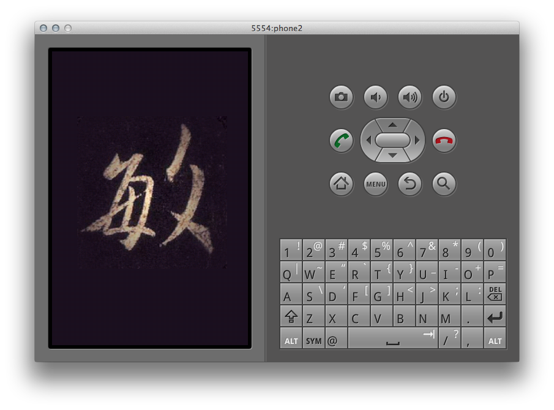

# Ming Operating System

This is an attempt to write a phone operating system for ARM based
phones. The aims of this project are:

1. *Security*. Defence in depth.
2. *Beauty*. Readable, maintainable.
3. *Easy*. Easy to use.

I will use Rust (because of the nice way it deals with ownership of
memory and the security it gives) ultimately aim to have the user
interface based on HTML. Having anything useful is a distant dream
though.

This project is just for fun.

Ming is named after my beautiful wife.

## Screenshot

## Installation guide

Unfortunately there are quite a few requirements to run this project:

- Download the code from github.
- Make sure you have the android emulator installed.
- Create an avd named phone2, with a screen size 320x240.
- Install cross-compiler for arm-linux-androideabi gcc cross compiler.
- Install the nightly version of Rust.
- Install clang.
- Run "make run" in the /src directory.

Alternately, to debug (which is highly useful)

- Run "make debug" in the /src directory
- Run "make debugger" in the /src directory (but from a different terminal)